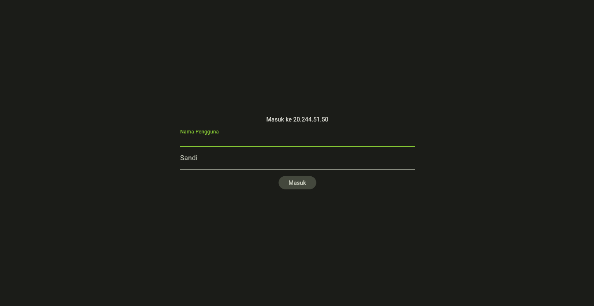
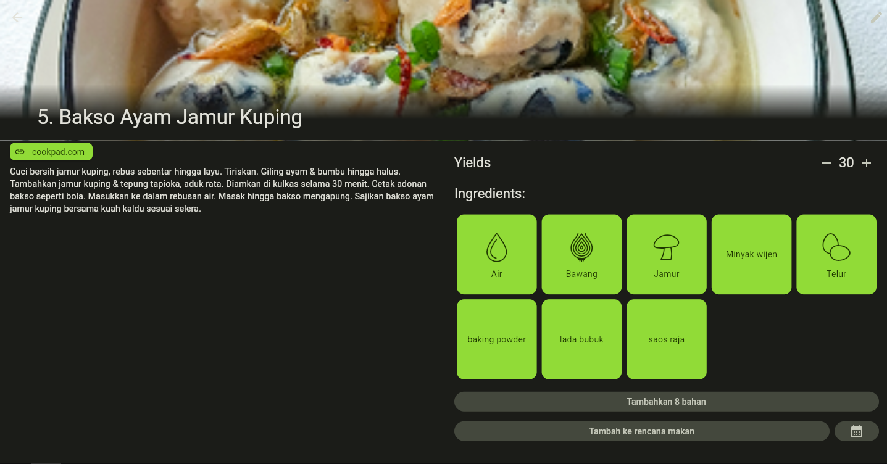
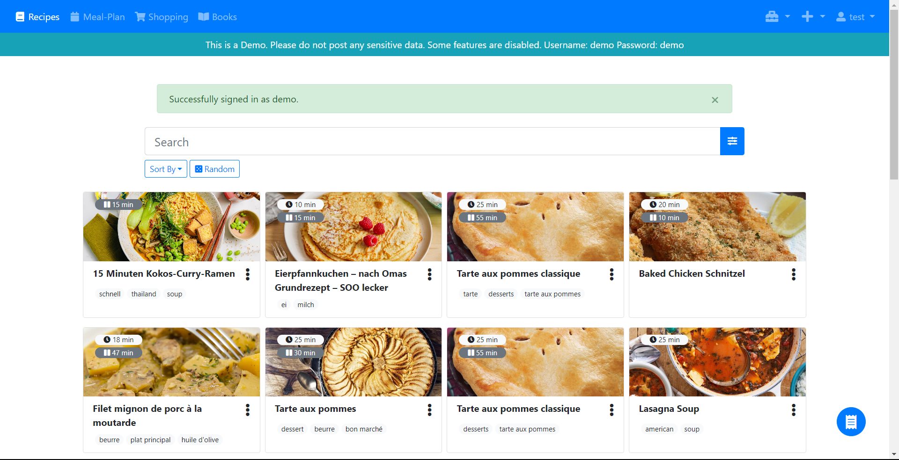
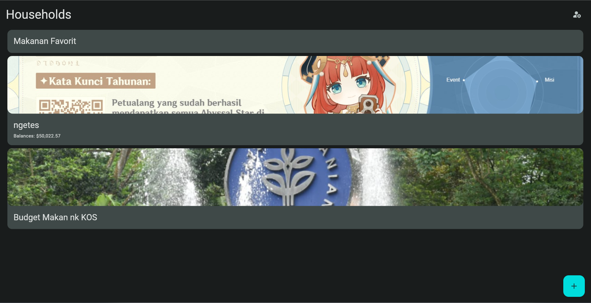
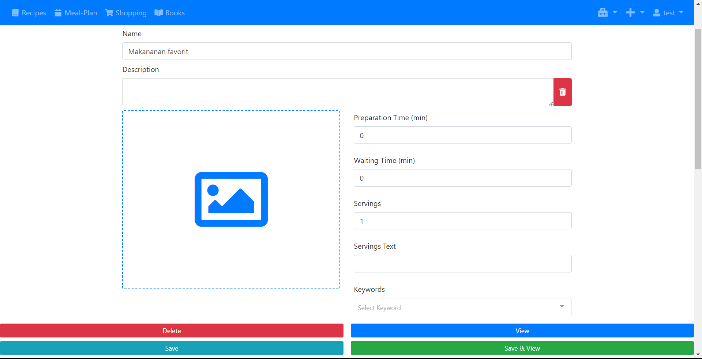
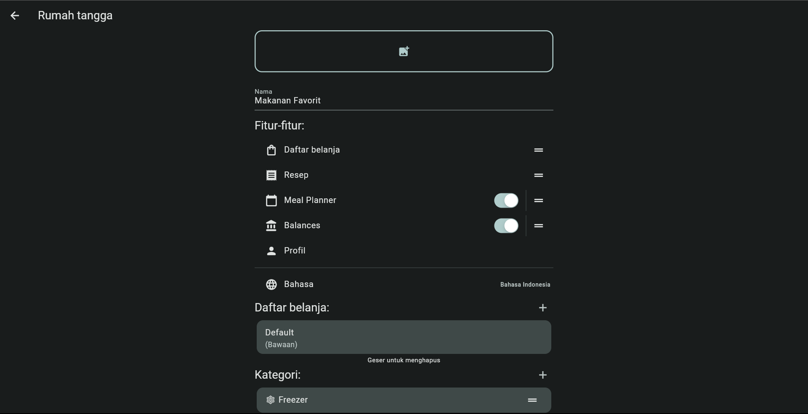

# Tugas Komdat Kel 3
### Aplikasi Web "KitchenOwl"
<h1 align="center"></h1>


# Sekilas Tentang
[`^ kembali ke atas ^`](#)

**KitchenOwl** adalah sebuah aplikasi lintas-platform yang canggih dan praktis yang dirancang untuk membantu Anda dalam berbagai aspek yang berkaitan dengan dapur dan makanan. Aplikasi ini menyediakan beragam fitur yang berguna, termasuk manajemen daftar belanja, penyimpanan resep, pelacakan pengeluaran, dan perencanaan makanan, semuanya dalam satu platform yang mudah diakses. 

Dengan desain yang mengikuti konsep bahasa Material, KitchenOwl menawarkan tampilan yang intuitif dan modern, memudahkan penggunaan dan navigasi. Dengan aplikasi ini, Anda dapat mengoptimalkan pengalaman berbelanja, mengorganisir koleksi resep Anda, mengontrol pengeluaran dapur, dan merencanakan makanan dengan lebih efisien.

# Prasyarat
[`^ kembali ke atas ^`](#)
- Linux OS (Ubuntu 20.04 LTS atau Debian 11)
- Docker
- Virtual Machine Azure

# Instalasi
[`^ kembali ke atas ^`](#)
1. Login ke server menggunakan ssh

   buka shell
    
   contoh:
   ```
   ssh khalid@20.244.51.50
   ```
   lalu masukan password virtual machine
3. Docker
   
   Ubuntu: [Panduan Instalasi Docker pada Ubuntu](https://docs.docker.com/engine/install/ubuntu)
   
4. Clone repositori KitchenOwl dari GitHub:
   
    ```bash
    git clone https://github.com/TomBursch/kitchenowl.git
    ```

5. Masuk ke direktori KitchenOwl:

    ```bash
    cd kitchenowl
    ```
6. Mengatur port (opsional)

   ikuti langkah dokumentasi (docker compose) yang ada pada github KitchenOwl [disini](https://docs.kitchenowl.org/self-hosting/)

7. Jalankan aplikasi menggunakan Docker Compose:

    ```bash
    nano docker compose up -d
    ```

    Aplikasi web akan dapat diakses melalui http://ip-vm:port

# Konfigurasi
[`^ kembali ke atas ^`](#)

Beberapa konfigurasi tambahan mungkin diperlukan tergantung pada kebutuhan, seperti mengatur batas upload file atau memori. Namun, untuk penggunaan dasar, konfigurasi standar Docker Compose sudah mencukupi.

# Maintenance
[`^ kembali ke atas ^`](#)

- Untuk membuat backup database tiap pekan, Anda dapat menggunakan alat seperti `docker exec` untuk menjalankan perintah backup pada kontainer Docker yang sesuai.
- Untuk menghapus direktori sampah, Anda dapat menggunakan cronjob dengan perintah `rm` yang sesuai.

# Cara Pemakaian
[`^ kembali ke atas ^`](#)

- Akses aplikasi melalui web browser dengan URL: http://20.244.51.50/
- Login
  <h1 align="center"></h1>
- Setelah login, anda akan masuk ke menu household dan dapat membuat household baru
  <h1 align="center"></h1>
  <h1 align="center"></h1>
  
Di dalam household terdapat berbagai fitur:
1. Anda dapat membuat daftar belanja dengan mencari item belanja yang ingin anda tambahkan pada menu search
<h1 align="center"></h1>

2. Pada menu resep anda dapat membuat maupun menambahkan resep
- Anda dapat menambahkan resep pada button disebelah kanan bawah
<h1 align="center"></h1>
- Terdapat dua pilihan untuk menambahkan resep, cara pertama anda dapat mengakses website https://cookpad.com/ dan copy-paste pada menu tambahkan resep dari URL
<h1 align="center"></h1>
    1. Copy-paste link pada website cookpad
<h1 align="center"></h1>
<h1 align="center"></h1>
    2. Kemudian lengkapi resep yang anda tambahkan dari link cookpad
<h1 align="center"></h1>
<h1 align="center"></h1>
    3. Setelah melengkapi anda dapat melihat preview resep yang anda tambahkan
<h1 align="center"></h1>
- Cara kedua anda dapat menambahkan secara manual
<h1 align="center"></h1>

3. Pada menu Meal Planner anda dapat menambahkan jadwal makanan yang telah anda buat pada menu resep
<h1 align="center"></h1>

4. Pada menu Balances anda dapat mencatat pemasukan maupun pengeluaran
<h1 align="center"></h1>
<h1 align="center"></h1>

# Pembahasan
[`^ kembali ke atas ^`](#)

#### Pendapat

KitchenOwl adalah aplikasi yang bermanfaat untuk manajemen dapur dan rencana makan. Antarmuka pengguna yang menggunakan desain bahasa Material memudahkan pengguna untuk berinteraksi dengan aplikasi. Memiliki fungsionalitas yang Luas dengan menawarkan beragam fitur yang mencakup manajemen daftar belanja, penyimpanan resep, pelacakan pengeluaran, dan perencanaan makanan. Desain aplikasi website juga sangat memperhatikan pengoptimalan pengalaman berbelanja pengguna, seperti adanya manajemen daftar belanja yang dapat membantu pengguna dalam merencanakan belanjaan mereka dengan lebih efisien.
Organisasi Resep yang Mudah: Kemampuan untuk menyimpan dan mengatur resep-resep favorit memudahkan pengguna dalam memantau dan mengakses resep yang mereka butuhkan. Ini juga dapat membantu dalam merencanakan makanan sehari-hari.

#### Kelebihan

- Antarmuka pengguna yang ramah pengguna dan mudah digunakan.
- Fitur lengkap termasuk manajemen daftar belanja, penyimpanan resep, pelacak pengeluaran, dan perencana makanan.
- Fitur pengorganisasian resep yang mudah.
- Perencanaan makanan yang efisien.

#### Kekurangan

- Proses instalasi awal mungkin sedikit rumit bagi pengguna yang tidak terbiasa dengan Docker dan terminal.
- Kerentanan web terhadap cyberattack.

#### Perbandingan dengan Aplikasi Sejenis

Dibandingkan dengan Tandoor, KitchenOwl memiliki antarmuka utama yang lebih modern, dan juga dengan variasi tema yang lebih bervariatif. 
<h1 align="center"></h1> <h1 align="center"></h1>

Fitur yang terdapat dalam pembuatan household pada KitchenOwl pun lebih beragam dibanding dengan yang ada pada Tandoor. Hal ini memudahkan user dalam mengkategorikan kebutuhannya dengan lebih terstruktur dengan fitur yang ada.
<h1 align="center"></h1> <h1 align="center"></h1>

# Referensi
[`^ kembali ke atas ^`](#)

- GitHub KitchenOwl Repository: [https://github.com/TomBursch/kitchenowl](https://github.com/TomBursch/kitchenowl)
- Docker Compose Documentation: [https://docs.docker.com/compose/](https://docs.docker.com/compose/)
- Github Tandoor Demo: [https://app.tandoor.dev/](https://app.tandoor.dev/)
